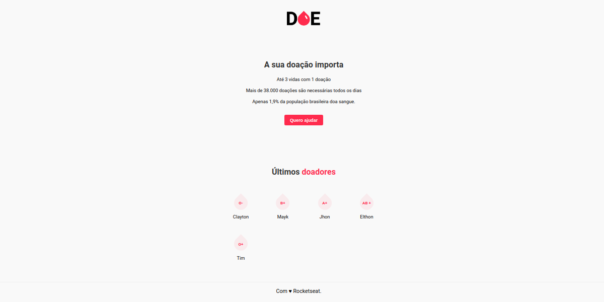
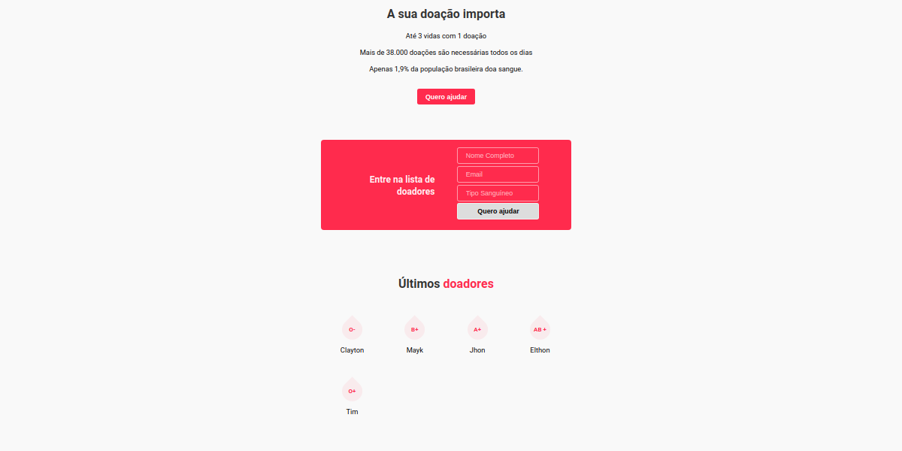
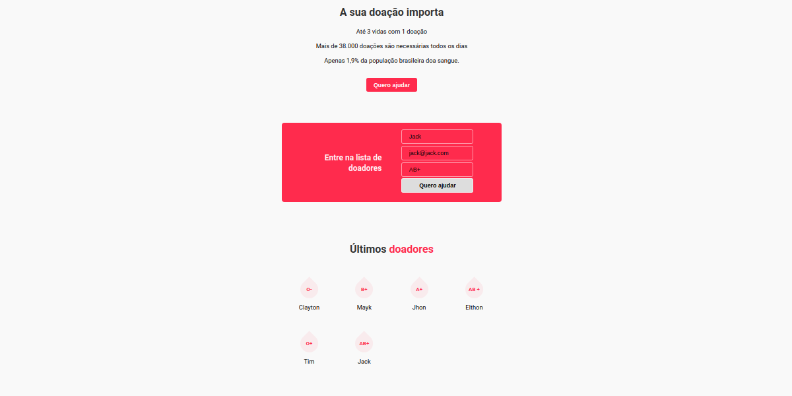
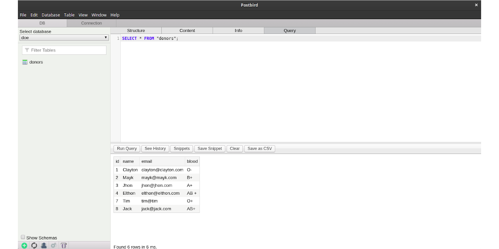

<h1 align="center">
    
</h1>

<h2 align="center"> Um sistema de cadastro de doadores de sangue </h2>

<h3 align="center"> Aplicação web criada a partir da 3ª MaratonaDev da Rocketseat, evento online ocorrido gratuitamente durante os dias 17 e 18 de Fevereiro de 2020 </h3>

<h3 align="center"> Instrutor: <a href="https://github.com/maykbrito">Mayk Brito</a> </h3>

  

## Tecnologias
### Front-end
- **HTML5**
- **CSS3**
- **JS**
### Back-end
- **JS**
- **Servidor Node.js**
  - Com as dependências **Express, Nodemon e Nunjucks**
- **Banco de Dados Postgres**

## Dependências

Instaladas através do npm, o **express** (para o servidor web), o **nodemon** (para escutar os arquivos e diretórios, sem precisar reiniciar o nodejs a cada alteração) e o **nunjucks** (para organizar e manipular os conteúdos HTML de forma dinâmica, através de templates engines).

### Banco de dados Postgres
Ligação através do cliente PostgreSQL para node.

Foi criado um banco chamado "**doe**", com uma tabela "**donors**" e com as linhas **id**, **name**, **email** e **blood**.

## Para rodar a aplicação

Clone o projeto e dentro da pasta `doe/` execute:

`npm install`

Para instalar as dependências.

Então, rode:

`npm start`

O terminal deve retornar: "Servidor iniciado."

Acesse via **localhost:3000**

## Retornos
Caso algum dos campos do formulário não sejam preenchidos, retornará na index:

`Todos os campos são obrigatórios.`

Em caso de algum erro no banco de dados, na sua conexão por exemplo, retornará na index:

`Erro no banco de dados.`

Havendo a conexão e preenchimento corretos, a página será recarregada e será adicionada em "últimos doadores" mais uma div com o nome e o tipo sanguíneo cadastrados.

## Interface

Visualização inicial da página

---

Ao clicar no botão

---

Cadastramento de um novo doador e visualização na lista de últimos doadores

---

Visualização no postbird dos doadores cadastrados no banco de dados postgres

  

Developed at [Rocketseat GoStack Bootcamp](https://www.rocketseat.com.br/bootcamp).

  

---

<h4 align="center"> <em>&lt;/&gt;</em> by <a href="https://github.com/herrmannjob" target="_blank">Gabriel Herrmann Grecchi</a> </h4>
